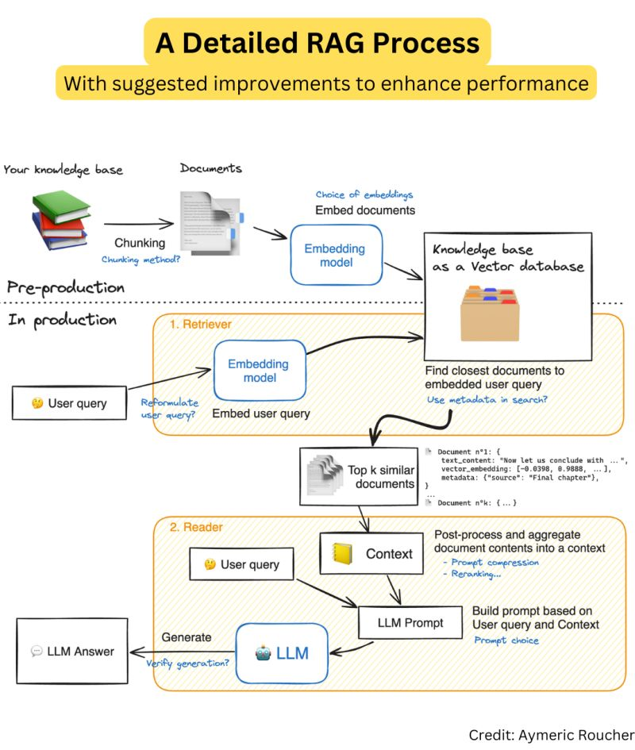

## RAG
[RAG 1-30](chethanhn29/Data-science-ML-and-DL-Resources/Interview_preparation/LLM/RAG-1-30.pdf)
[RAG 30-45](chethanhn29/Data-science-ML-and-DL-Resources/Interview_preparation/LLM/RAG-31-75-1-30.pdf)
[RAG 30-45](chethanhn29/Data-science-ML-and-DL-Resources/Interview_preparation/LLM/RAG-31-75-31-45.pdf)
### Articles
- [RAG Article](https://stackoverflow.blog/2023/10/18/retrieval-augmented-generation-keeping-llms-relevant-and-current/)

### YouTube Playlists
- [RAG From Scratch by Langchain](https://www.youtube.com/watch?v=wd7TZ4w1mSw&list=PLfaIDFEXuae2LXbO1_PKyVJiQ23ZztA0x)
 

