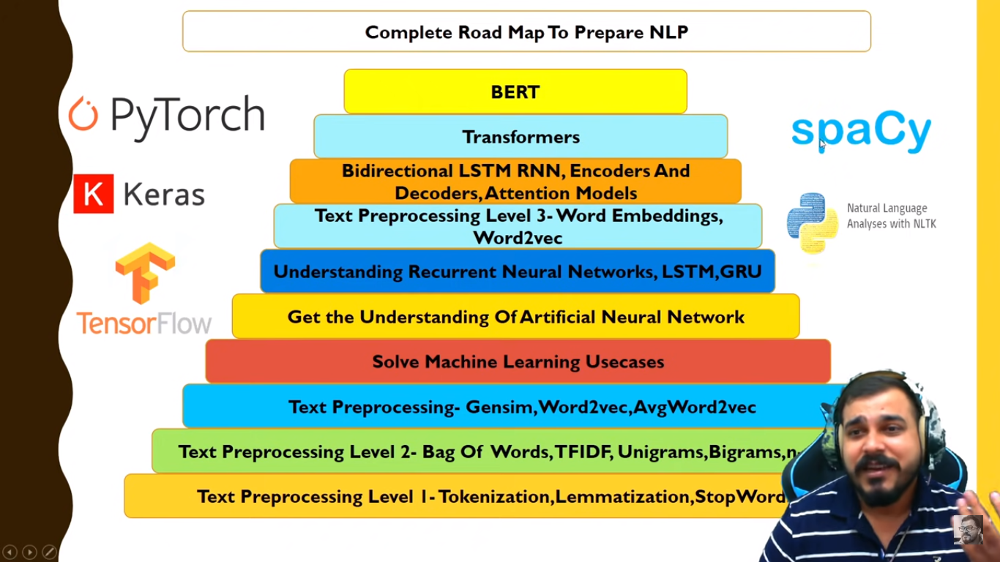

# Resources for Interview Preparation

This repository contains a curated list of resources to help you prepare for various types of interviews, including HR interviews, technical interviews for Python, Data Science, SQL, Statistics, and more.

## Data Science and Machine Learning Interview Preparation
### [overview-of-rnn-lstm-and-attention-mechanism](https://medium.com/swlh/a-simple-overview-of-rnn-lstm-and-attention-mechanism-9e844763d07b)
### Deep Learning Resources:
- [DeepLearning.ai Summary](https://github.com/mbadry1/DeepLearning.ai-Summary)
- [CS231n 2017 Summary](https://github.com/mbadry1/CS231n-2017-Summary)
- [NLP Fundamentals](https://aman.ai/primers/ai/)
- [NLP Interview Questions](https://aman.ai/primers/ai/interview/#nlp)

### Other Resources
- [Data Science Interview Resources Repo](https://github.com/rbhatia46/Data-Science-Interview-Resources/tree/master)
- [Resources for Data Science Interview preparation](https://drive.google.com/drive/folders/1dvv32hBxsE1XIK8kHs1fI0PjeRSKKE77?usp=drive_link)
- [Data Science Interview preparation Github Repo](https://github.com/rbhatia46/Data-Science-Interview-Resources/blob/master/README.md)

- [Data Science Interview questions by Krishnaik Repo](https://github.com/kirankrish109/interview-question-data-science--master)

## [For Quick Revision of NLP](https://aman.ai/primers/ai/)

- [Tokenization,Stemming,Lemmatization,Stopwords](https://github.com/chethanhn29/Personal-Collection-of-Resources-to-learn/tree/main/Natural%20Language%20Processing(NLP)/Text_Preprocessing%20_Level_1)
- For More Data Preprocessing of NLP GO throgh this [blog](https://realpython.com/nltk-nlp-python/)

- [Word Embedding](https://github.com/chethanhn29/Personal-Collection-of-Resources-to-learn/tree/main/Natural%20Language%20Processing(NLP)/Text_Preprocessing_Level_3)
    - Glove- By Stanford-- Genism,Stanford NLP's Golve
    - Word2vec -Genism,Tensorflow,Pytorch
    - Fasttext -- [Repo](https://github.com/facebookresearch/fastText),Genism
    - ELMo:AllenNLP Library
    - Bert and Transfomer based Models- Hugging face
        - [Bert](https://jalammar.github.io/illustrated-bert/)
        - GPT
        - T5 
- [Word2Vec](https://github.com/chethanhn29/Personal-Collection-of-Resources-to-learn/blob/main/Natural%20Language%20Processing(NLP)/Text_Preprocessing)

- Avg Word2vec To get Vector Presentation of whole Sentence or each Entry in data for Classification
    - First get Vector Representation of each word in the whole corpus using Word2Vec Model of Genism library.
    - Then Average all the vectors for each sentence to get Vector Representation of Each sentence.
    - Then Reshape the vectors because it should act as indpe

- RNN Interview [Questions](#questions) , for Q and A go to end

- Word2Vec: Word2Vec is a popular word embedding technique that represents words as dense vectors. It includes two main models: Continuous Bag-of-Words (CBOW) and Skip-gram. CBOW predicts a target word based on its context words, while Skip-gram predicts the context words given a target word.

- GloVe: GloVe (Global Vectors for Word Representation) is another widely used word embedding technique. It leverages global word co-occurrence statistics to generate word embeddings. GloVe constructs a co-occurrence matrix from a corpus and factorizes it to obtain word vectors that capture both local and global word relationships.

- FastText: FastText is an extension of Word2Vec that introduces subword information into the word embeddings. It represents words as bags of character n-grams and learns embeddings for both words and subwords. This approach is particularly useful for handling out-of-vocabulary words and capturing morphological information.

- ELMo: ELMo (Embeddings from Language Models) is a contextual word embedding model that captures word meanings in context. It generates word embeddings by training a bidirectional language model on a large corpus. ELMo embeddings are contextualized, meaning they take into account the surrounding words to capture nuances and polysemy.

- BERT: BERT (Bidirectional Encoder Representations from Transformers) is a state-of-the-art contextual word embedding model. It uses a transformer architecture and pre-training objectives like masked language modeling and next sentence prediction. BERT embeddings capture rich contextual information and have achieved significant performance improvements in various NLP tasks.

- Transformer-based models: Besides BERT, there are other transformer-based models for word embeddings, such as GPT (Generative Pre-trained Transformer) and T5 (Text-to-Text Transfer Transformer). These models leverage the transformer architecture to capture complex linguistic patterns and generate powerful word representations.

[Tokenisation in NLP all methods](https://www.kaggle.com/code/satishgunjal/tokenization-in-nlp/notebook)

[How to Prepare Text Data for Deep Learning with Keras](https://machinelearningmastery.com/prepare-text-data-deep-learning-keras/)

[Analytics Vidya](https://www.analyticsvidhya.com/blog/2019/07/how-get-started-nlp-6-unique-ways-perform-tokenization/)

## NLP Interview Preparation

Preparing for an NLP interview can be challenging, as the field is broad and rapidly evolving. However, here are some key topics and areas you should consider focusing on:

1. **Basics of NLP**: Understand the fundamental concepts, techniques, and applications in natural language processing. Familiarize yourself with topics like text preprocessing, feature extraction, text classification, information retrieval, sentiment analysis, and named entity recognition.

2. **Machine Learning Algorithms**: Gain knowledge of various machine learning algorithms commonly used in NLP, such as Naive Bayes, Support Vector Machines (SVM), Random Forests, and neural networks (e.g., Convolutional Neural Networks and Recurrent Neural Networks).

3. **Word Embeddings**: Study popular word embedding models like Word2Vec, GloVe, and FastText. Understand how they generate dense vector representations for words and how these representations capture semantic relationships.

4. **Language Models**: Be familiar with language models like ELMo, BERT, and GPT, which have significantly impacted NLP. Understand their architectures, pre-training objectives, and applications, as well as the concept of transfer learning in NLP.

5. **Evaluation Metrics**: Learn about evaluation metrics used in NLP tasks, such as accuracy, precision, recall, F1-score, and BLEU score. Understand when and how to use these metrics effectively to assess model performance.

6. **Deep Learning Architectures**: Gain knowledge of deep learning architectures commonly used in NLP, such as recurrent neural networks (RNNs), long short-term memory (LSTM), and attention mechanisms. Understand how these architectures are used for tasks like sequence labeling, machine translation, and text generation.

7. **Data Preprocessing**: Be well-versed in common data preprocessing techniques specific to NLP, such as tokenization, stemming, lemmatization, stop word removal, and handling of special characters or numerical values in text data.

8. **Domain-specific Knowledge**: If you are applying for an NLP role in a specific industry, research and familiarize yourself with relevant domain-specific datasets, challenges, and techniques related to that industry (e.g., healthcare, finance, or social media analysis).

9. **Recent Advancements**: Stay updated with the latest advancements and research papers in the NLP field. Follow conferences like ACL, EMNLP, and NeurIPS, and be aware of recent breakthroughs and trends such as self-supervised learning, transformers, and zero-shot learning.

10. **Hands-on Experience**: Practice implementing NLP models and algorithms using libraries like NLTK, spaCy, scikit-learn, and deep learning frameworks such as TensorFlow or PyTorch. Work on NLP projects or Kaggle competitions to gain practical experience.

Remember to showcase your problem-solving skills, critical thinking, and ability to apply NLP techniques to real-world scenarios during the interview. It's also beneficial to demonstrate your understanding of ethics and considerations surrounding bias, fairness, and privacy in NLP applications.

Additionally, don't hesitate to ask questions during the interview to show your enthusiasm and curiosity about NLP. Good luck!

### RNN Interview Questions
### 1. What is a Recurrent Neural Network (RNN)?

A Recurrent Neural Network (RNN) is a type of artificial neural network designed for sequence data processing. It can handle inputs of variable lengths and has memory to retain information about past inputs. RNNs are particularly effective in tasks like natural language processing, speech recognition, and time series analysis.

### 2. Explain the concept of the vanishing gradient problem in RNNs.

The vanishing gradient problem refers to the issue where the gradients propagated through the recurrent connections in an RNN diminish over time, making it difficult for the network to learn long-range dependencies. This problem arises due to the repeated multiplication of gradient values during backpropagation, causing the gradients to become very small. As a result, earlier time steps in the sequence have less influence on the weight updates, leading to suboptimal learning.

### 3. What are the different types of RNN architectures?

There are several RNN architectures used to address the limitations of traditional RNNs:

- **Simple RNN**: Basic RNN architecture that suffers from the vanishing gradient problem.
- **Long Short-Term Memory (LSTM)**: Introduces memory cells and gates to selectively retain and update information.
- **Gated Recurrent Unit (GRU)**: Simplified version of LSTM with fewer gates, making it computationally more efficient.
- **Bidirectional RNN**: Combines two RNNs to process sequences in both forward and backward directions, capturing past and future context simultaneously.
- **Stacked RNN**: Multiple layers of RNNs stacked on top of each other to learn hierarchical representations.

### 4. How does an LSTM cell work?

An LSTM cell consists of three main components: an input gate, a forget gate, and an output gate. These gates regulate the flow of information within the cell. The input gate determines which parts of the input to let through, the forget gate decides what information to discard from the cell state, and the output gate controls the flow of information to the output. The cell state retains the memory of past inputs, allowing the LSTM to capture long-range dependencies.

### 5. How do you handle variable-length sequences in an RNN?

To handle variable-length sequences in an RNN, padding and masking techniques are commonly used. Padding involves adding placeholder values (e.g., zeros) to the shorter sequences to match the length of the longest sequence. Masking is then applied to ignore the padded values during computations, ensuring that the RNN only operates on the actual sequence data.

Example:

Consider a batch of sequences with varying lengths: ['I love NLP', 'Hello', 'OpenAI']. To apply padding, the sequences can be padded as follows:
- ['I love NLP', 'Hello    ', 'OpenAI  ']

Masking can then be applied using a binary mask, indicating the valid positions:
- [1, 1, 1, 1, 1, 0, 0, 0]
- [1, 1, 1, 1, 1, 1, 1, 0]
- [1, 1, 1, 1, 1, 1, 1, 1]

The zeros in the mask indicate the padded positions.

### 6. What is the concept of teacher forcing in RNN training?

Teacher forcing is a technique used during training RNNs for sequence generation tasks. Instead of using the generated output at each time step as the input for the next time step, teacher forcing involves using the true target value as the input. This approach helps stabilize training by providing the network with correct inputs during the training process. However, it can lead to a discrepancy between training and inference, as during inference, the network needs to generate outputs based on its own predictions.

Example:

Given a sequence input ['I', 'love', 'NLP'] and the corresponding target output ['love', 'NLP', 'too'], teacher forcing involves using the true target output ['love', 'NLP', 'too'] as the input at each time step during training.

### 7. What is the purpose of the input, hidden, and output layers in an RNN?

The input layer in an RNN receives the input sequence, the hidden layer retains information from past inputs and updates at each time step, and the output layer produces the prediction or output for each time step. The hidden layer acts as the memory of the RNN, allowing it to capture temporal dependencies in the input sequence.

### 8. How does backpropagation through time (BPTT) work in RNNs?

Backpropagation through time (BPTT) is the algorithm used to train RNNs. It unfolds the RNN through time and performs backpropagation, treating the unfolded network as a deep feedforward neural network. The gradients are computed at each time step and accumulated over time, allowing the weights to be updated based on the entire sequence.

### 9. What are the challenges of training RNNs?

Training RNNs can be challenging due to several factors:
- **Vanishing or Exploding Gradients**: The gradients can become very small or very large during backpropagation, affecting the stability of training.
- **Long-Term Dependencies**: Traditional RNNs struggle to capture dependencies over long sequences, leading to poor performance.
- **Computational Efficiency**: RNNs are computationally expensive to train, especially with long sequences, due to the sequential nature of processing.

### 10. What are the advantages of using LSTM or GRU over simple RNNs?

LSTM (Long Short-Term Memory) and GRU (Gated Recurrent Unit) address some limitations of simple RNNs:
- **Long-Term Dependencies**: LSTM and GRU use gating mechanisms to selectively retain and update information over long sequences, allowing them to capture long-term dependencies.
- **Vanishing Gradient Problem**: By incorporating memory cells and gating, LSTM and GRU mitigate the vanishing gradient problem, enabling more effective training.

### 11. What is the concept of sequence-to-sequence (seq2seq) modeling with RNNs?

Sequence-to-sequence modeling involves using an RNN to process an input sequence (encoder) and generate an output sequence (decoder). It is commonly used in tasks like machine translation, chatbots, and text summarization. The encoder RNN encodes the input sequence into a fixed-length context vector, which is then used by the decoder RNN to generate the output sequence.

### 12. How can you handle overfitting in RNN models?

To address overfitting in RNN models, several techniques can be used:
- **Regularization**: Apply techniques like L2 regularization or dropout to reduce overfitting by adding constraints or randomly dropping units during training.
- **Early Stopping**: Monitor the validation loss during training and stop the training process when the loss starts to increase, indicating overfitting.
- **Model Complexity**: Reduce the complexity of the model by reducing the number of parameters or using simpler architectures.

### 13. What is the concept of attention in RNNs?

Attention mechanisms in RNNs allow the model to focus on different parts of the input sequence when generating the output. Rather than relying solely on the final hidden state of the encoder, attention mechanisms dynamically compute weights for each input step, indicating their relative importance. This enables the model to selectively attend to relevant information, improving performance in tasks like machine translation or summarization.

### 14. What are the limitations of traditional RNNs for processing long sequences?

Traditional RNNs suffer from the vanishing gradient problem and have difficulty capturing long-term dependencies. As the sequence length increases, the influence of earlier inputs diminishes, making it challenging to learn dependencies across long sequences. This limitation hampers the ability of traditional RNNs to model complex patterns in long sequences effectively.

### 15. What is the concept of sequence generation with RNNs?

Sequence generation with RNNs involves training a model to generate new sequences based on the patterns learned from the training data. This can be achieved by training an RNN to predict the next item in a sequence given the previous context. The model can then be used to generate new sequences by iteratively predicting subsequent items based on its own generated outputs.

### 16. How can you handle variable-length sequences for batch training in RNNs?

To handle variable-length sequences for batch training in RNNs, padding and masking techniques are commonly used. Padding involves adding placeholders (e.g., zeros) to shorter sequences to match the length of the longest sequence in a batch. Masking is then applied to ignore the padded values during computations, ensuring that the RNN only operates on the actual sequence data.

