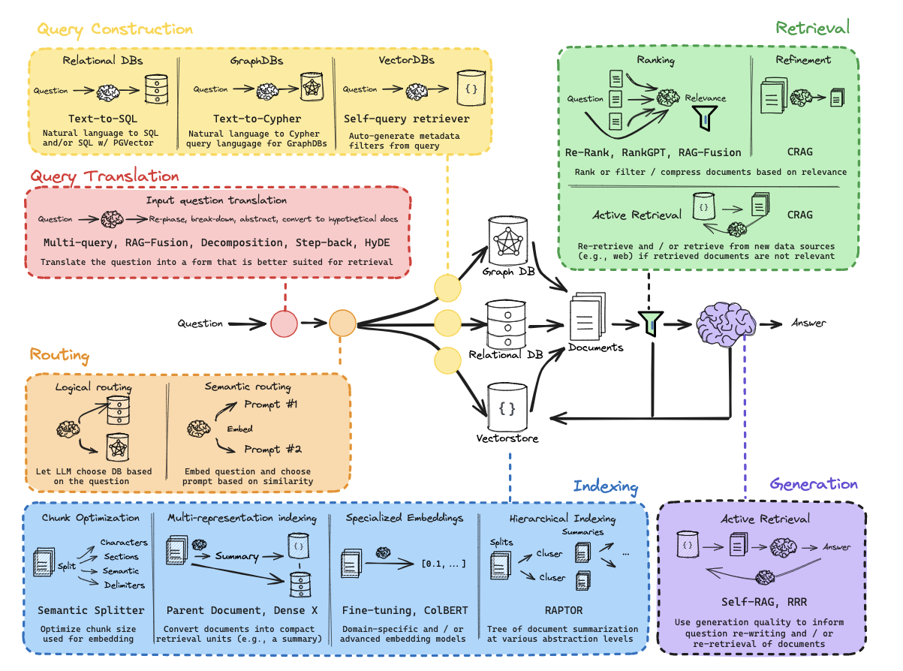

### [RAG From Sratch by langchain code walkthrough](https://github.com/langchain-ai/rag-from-scratch/tree/main)
.png>) 
.png>)
.png>) 

- **Topic**: Introduction to Retrieval-Augmented Generation (RAG)
- **Motivation for RAG**:
  - LLMs (Large Language Models) lack access to all relevant data, especially private or recent data, due to limitations in pre-training.
  - LLMs have context windows that are increasing in size, but they are still limited compared to external data sources.
- **Concept of RAG**:
  - RAG connects LLMs to external data sources to enhance their capabilities.
  - RAG involves three stages: indexing, retrieval, and generation.
- **Indexing**:
  - Involves organizing external documents for easy retrieval based on input queries.
- **Retrieval**:
  - Relevant documents are retrieved based on input queries and fed into the LLM.
- **Generation**:
  - The LLM uses retrieved documents in the final stage to produce an answer.
- **Series Structure**:
  - A new series called "RAG from Scratch" will cover basic principles of RAG, leading to advanced topics.
  - Videos will be kept short (around five minutes) and will delve into advanced themes.
- **Code Walkthrough**:
  - A notebook demonstrates a RAG quick start.
  - It loads documents, splits them, embeds and indexes them into a Vector store, and defines prompts for RAG.
  - The code sets up a retriever, prompt, and LLM, and executes the RAG process.

